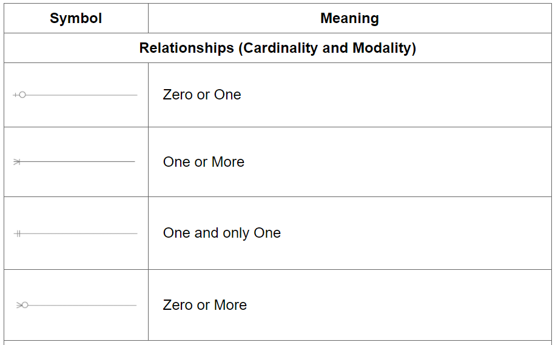

<h5 style="text-align: right;">Wrocław, 25.05.2021r. </h5>

# BAZY DANYCH 

## Projekt 

<br>

| Wydział Elektroniki | Kierunek: Informatyka techniczna |
|---------------------|----------|
| Grupa zajęciowa: TP Wt15.15                 | Semestr 2020/21 LATO   |
| Łach Piotr           |       |
| Jakub Szpak           |     |

<br>

## Temat: Galeria sztuki

<br>


<div style="page-break-after: always;"></div>

<br>

## Opis zakresu i kontekstu:

Baza danych systemu zarządzania aukcjami eksponatów. 

Największą tabelą galerii sztuki jest <b>[Eksponaty]</b>. Eksponaty mają określone tytuły, ceny wywoławcze, style, daty i miejsca powstania, autora i są przynależne do różnych grup takich jak obrazy, rzeźby czy utwory muzyczne - rodzaj eksponatu. Każdy eksponat jest dziełem artysty, o którym dane, takie jak, imię i nazwisko, miejsce urodzenia przechowuje <b>[Artyści]</b>. <b>[Aukcje]</b> przechowuje placówki, eksponaty oraz daty aukcji. <b>[Transakcje]</b> przechowuje informację o dacie wykonania transakcji, kliencie oraz eksponacie i cenie. Tabela umożliwia podejrzenie historii zakupowej danej osoby. Do każdej transakcji jest przypisany pracownik oraz dom aukcyjny. <b>[Placówki]</b> przechowuje informacje o dostępnych domach aukcyjnych. <b>[Pracownicy]</b> przechowuje dane o pracownikach, a także ilości sprzedanych eksponatów (w celu na przykład premiowania pracowników). <b>[Klienci]</b> przechowuje podstawowe dane o kliencie w postaci imienia, nazwiska i numeru telefonu.

<br>

## Opis wymagań funkcjonalnych projektowanego systemu:

- Przegląd wystawionych eksponatów 
- Zestawienie artystów 
- Zarządzanie aukcjami eksponatów - pracownicy
- Analiza domów aukcyjnych - pracownicy
- Wyciąg transakcji (sprzedaż, zakup) - pracownicy
- Sprawdzenie autentyczności eksponatu 
- Generowanie zestawień pracowników - właściciel

- Wizualizacja kalendarza, miejsc nadchodzących aukcji eksponatów
-  Ustawianie nowych terminów aukcji wraz z miejscami i listą eksponatów licytowanych na nich - pracownicy


<div style="page-break-after: always;"></div>

## Szczegółowy opis systemu, opis ról zawartych w systemie

Galeria sztuki to rozległy system do zarządzania siecią domów aukcyjnych. Konstrukcja pozwala na symulację agentową zachowania takiej struktury w realnym świecie. 

System wyszczególnia trzy role: Właściciela, Pracownika oraz Klienta w kolejności od aktora z największymi przywilejami. Oznacza to, że wszystkie możliwości przypisane pracownikowi są również dane właścicielowi, lecz nie działa to na odwrót. Pracownik nie ma upoważnienia do posługiwania się funkcji, którymi dysponuje właściciel. Podobną relacją związani są pracownik i klient. 

Funkcje należące do właściciela to między innymi: wyznaczanie terminów nadchodzących aukcji i generowanie zestawień pracowników, placówek. Należy tutaj wyszczególnić, że wyznaczenie terminu licytacji wiąże się ze stworzeniem poprawnego rozeznania w wynikach poprzednich wydarzeń i tutaj właściciel ma obowiązek wykorzystać funkcje badawcze i rozeznaniowe systemu. Generowanie poszczególnych zestawień to bardzo ważna rola systemu. Pozwoli ona właścicielowi na zebranie potrzebnych informacji i odpowiedzenie sobie na pytania takie jak: Gdzie już dłuższy czas nie było aukcji? Która z ostatnich aukcji przyniosła największe zyski i co dokładnie na niej sprzedano ? Który pracownik powinien poprowadzić aukcję? Czy któraś placówka generuje średnio większe zyski niż inne i dlaczego? Na podstawie tych pytań właściciel ma za zadanie zadecydować gdzie, kiedy i jakie eksponaty będzie liczyć aukcja i następnie dodać nowe pole z tymi danymi do kalendarza. 

Następnym aktorem jest Pracownik, który ma wiele zadań, do których należą między innymi wizualizacja i kontrola aukcji, wyciąg transakcji, czyli uzyskanie informacji w bazie danych na temat tego kto, co, gdzie, kiedy i za ile kupił w razie potrzeby czy aktualizacja autentyczności eksponatów czyli zmiana statusu eksponatu w bazie na sprawdzony po wykonaniu na nim odpowiednich testów autentyczności syngalizując tym samym że dzieło jest gotowe do wystawienia na aukcję.

Ostatnim aktorem jest klient, który pełni rolę obserwatora. Jego jedyną możliwością jest podglądanie danych, które zostały mu udostępnione. Nie ma on dostępu do danych wrażliwych takich jak spis transakcji, lecz może on obejrzeć eksponaty, ich opisy czy artystów. Ma on również możliwość sprawdzenia nadchodzących aukcji. Posumowując ma on dostęp do tabel takich jak eksponaty, artyści, aukcje jednak nie może on wprowadzać zmian w żadnej z nich.

<div style="page-break-after: always;"></div>

## Diagram przypadków użycia

<div style="text-align:center"></div>


<div style="text-align:center"></div>

<br><br><br>

<div style="page-break-after: always;"></div>

## Diagram ERD w notacji Martina


<div style="text-align:center"></div>


### Opis notacji

W diagramie ERD wyróżniamy 4 typy połączeń:
- ZERO OR ONE - zero lub jedno powiązanie,
- ONE OR MORE - jedno lub więcej powiązanie,
- ONE AND ONLY ONE - jedno i tylko jedno powiązanie,
- ZERO OR MORE - zero lub więcej powiązań.

<div style="text-align:center"></div>


#### Opis wybranych relacji:

Clients -|- Transactions - Jeden klient może być powiązany z zeroma lub wieloma transakcjami, ale jedna transakcja dotyczy tylko jednego klienta

Transactions -|- Exhibits - Każda transakcja dotyczy tylko jednego eksponatu i każdy eksponat, może być powiązany z tylko jedną transakcją

Artists -|- Exhibits - Każdy eksponat jest własnością jednego artysty, ale artysta może mieć wiele eksponatów

Exhibits -|- Auctions - Każda aukcja może mieć przyporządkowane wiele eksponatów, a eksponat może być przyporządkowany do jednej lub żadnej aukcji (pole AuctionId jest NULLABLE)

Auctions -|- Institutions - W jednej placówce może odbyć się wiele aukcji, a jedna aukcja może odbywać się tylko w jednej placówce

Auctions -|- Employees - Jedną aukcją przewodzi jeden pracownik, ale jeden pracownik może być podporządkowany wielu aukcjom

## Implementacja bazy danych

Wybrane fragmenty skryptu:
- utworzenie tabeli Clients i triggera ustawiającego id nowego elementu na o jeden większy od poprzedniego:

```sql
CREATE TABLE "CLIENTS" (
"ID" NUMBER(*,0) NOT NULL,
"PERSONAL_DATA_ID" NUMBER(*,0) NOT NULL,
"ADDRESS_ID" NUMBER(*,0) NOT NULL,
CONSTRAINT "Cli_Personal_FK" FOREIGN KEY (PERSONAL_DATA_ID) REFERENCES PERSONAL_DATA(ID),
CONSTRAINT "Cli_Address_FK" FOREIGN KEY (ADDRESS_ID) REFERENCES ADDRESSES(ID)
);

ALTER TABLE "CLIENTS" ADD (
CONSTRAINT cli_pk PRIMARY KEY (ID));

CREATE SEQUENCE cli_seq START WITH 1;

CREATE OR REPLACE TRIGGER cli_bir 
BEFORE INSERT ON CLIENTS
FOR EACH ROW

BEGIN
  SELECT cli_seq.NEXTVAL
  INTO   :new.id
  FROM   dual;
END;
/
```

- wstawianie przykładowych rekordów do tabeli Personal_Data
```sql
INSERT INTO PERSONAL_DATA (first_name, last_name, phone_number) VALUES ('Clarance', 'Di Francecshi', '2651683434');
INSERT INTO PERSONAL_DATA (first_name, last_name, phone_number) VALUES ('Vick', 'Elverstone', '1489561889');
INSERT INTO PERSONAL_DATA (first_name, last_name, phone_number) VALUES ('Myrlene', 'Stodit', '3967621494');
```


- utworzenie triggera logów dla tabeli Clients

```sql
CREATE OR REPLACE TRIGGER CLIENTS_LOG 
AFTER INSERT OR UPDATE OR DELETE
ON CLIENTS
FOR EACH ROW
DECLARE
BEGIN
    IF inserting THEN
        INSERT INTO LOGS (TABLE_NAME, EVENT_TYPE, SQL_COMMAND, EVENT_DATE)
        VALUES ('CLIENTS', 'INSERT',
        CONCAT('INSERT INTO CLIENTS(Id, Personal_Data_Id, Address_Id) VALUES (',
        CONCAT(:NEW.ID,CONCAT(' , ', 
        CONCAT(:NEW.Personal_Data_Id, CONCAT(' , ',
        CONCAT(:NEW.Address_Id,');'
        )))))), 
        SYSDATE);
    ELSIF updating THEN
        INSERT INTO LOGS (TABLE_NAME, EVENT_TYPE, SQL_COMMAND, EVENT_DATE)
        VALUES ('CLIENTS', 'UPDATE', 
        CONCAT('UPDATE CLIENTS SET Personal_Data_Id = ',
        CONCAT(:NEW.Personal_Data_Id ,
        CONCAT(' ,  Address_Id = ',
        CONCAT(:NEW.Address_Id ,
        CONCAT(' WHERE Id = ', 
        CONCAT(:OLD.Id, ';'
        )))))),
        SYSDATE);
    ELSE 
        INSERT INTO LOGS (TABLE_NAME, EVENT_TYPE, SQL_COMMAND, EVENT_DATE)
        VALUES ('CLIENTS', 'DELETE',
        CONCAT('DELETE FROM CLIENTS WHERE ID = ', 
        CONCAT(:OLD.ID, ';'
        ))
        , SYSDATE);
    END IF;
END;
```

- utworzenie widoków
```sql
CREATE OR REPLACE VIEW MONTHLY_EMPLOYEE_REPORT
("FIRST_NAME", "LAST_NAME", "DATE", "SOLD_EXHIBIT_ID", "SOLD_EXHIBIT_NAME", "TRANSACTION_ID")
AS
SELECT p.first_name, p.last_name, a.auction_date, e.Id, e.Name, t.Id
FROM Transactions t
JOIN Exhibits e ON t.exhibit_id = e.Id
JOIN Auctions a ON e.auction_id = a.Id
JOIN Employees em ON a.employee_id = em.Id
JOIN Clients c ON em.client_id = c.Id
JOIN Personal_data p ON c.personal_data_id = p.Id
WHERE EXTRACT(MONTH FROM a.auction_date) = EXTRACT(MONTH FROM CURRENT_DATE) AND EXTRACT(YEAR FROM a.auction_date) = EXTRACT(YEAR FROM CURRENT_DATE);

--SELECT * FROM MONTHLY_EMPLOYEE_REPORT;

CREATE OR REPLACE VIEW EXHIBITS_READY_FOR_AUCTION
("NAME", "DESCRIPTION", "AUTHOR_FIRST_NAME", "AUTHOR_LAST_NAME", "STARTING_BID", "PLACE_OF_ORIGIN")
AS
SELECT e.name, e.description, p.first_name, p.last_name, e.starting_bid, e.place_of_origin
FROM exhibits e
JOIN artists a ON e.author_id = a.Id
JOIN personal_data p ON a.personal_data_id = p.Id
WHERE e.is_authentic = 1 and e.auction_id is  null;


--SELECT * FROM EXHIBITS_READY_FOR_AUCTION;

CREATE OR REPLACE VIEW UPCOMING_AUCTIONS
("DATE", "EMPLOYEE_FIRST_NAME", "EMPLOYEE_LAST_NAME", "INSTITUTION_NAME", "STREET", "CITY", "COUNTRY", "POST_CODE")
AS
SELECT a.auction_date, p.first_name, p.last_name, i.name, addresses.street, addresses.city, addresses.country, addresses.post_code
FROM auctions a
JOIN employees e ON e.Id = a.employee_id
JOIN clients c ON c.Id = e.client_id
JOIN personal_data p ON p.Id = c.personal_data_id
JOIN institutions i ON i.Id = a.institution_id
JOIN addresses ON addresses.Id = i.address_id
ORDER BY a.auction_date;

--SELECT * FROM UPCOMING_AUCTIONS;
```

